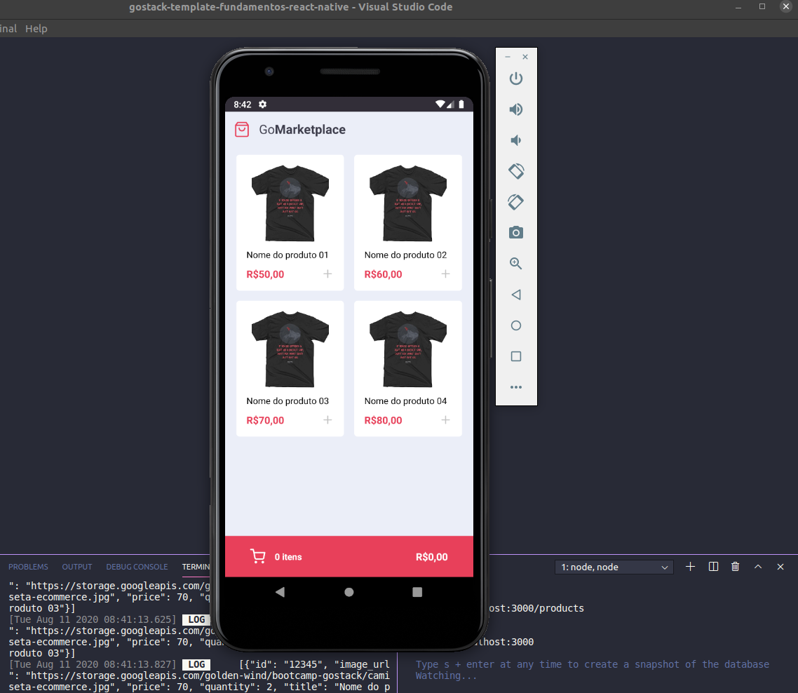

# Fundamentos-do-React-Native

锔  um desafio de desenvolver uma nova aplica莽茫o, a GoMarketplace. Usando React Native junto com o TypeScript, utilizando rotas, Async Storage e a Context API.

<h2>Como Executar</h2>

Clone o repositório usando o comando: (não esqueça de estar na pasta que deseje que o repositório fique)
   
  <code>git clone https://github.com/nortongoncalves/Fundamentos-do-React-Native.git</code>

Após terminar o download entre na pasta e use o comando abaixo para instalar todas as dependencias
   
  <code>yarn install</code>

Temos algumas formas para executar o projeto:

<ul>
  <tbody>
    <li>Em um emulador: tanto android ou ios</li>
    <li>No proprio telefone via usb</li>
    <li>ou pelo wifi</li>
  </tbody>
</ul>

Nesse site temos um ótimo tutorial que mostra as 3 opções acima 

<a href="https://react-native.rocketseat.dev/">🔗 Rocketseat Docs | Ambiente React Native</a>
 

Antes de iniciar o projeto devemos executar o servidor(json-server).
   
  <code>yarn run server</code>

E para o emulador conseguir se conectar com o servidor devemos executar o comando:
   
  <code>adb reverse tcp:3000 tcp:3000</code>

Se estiver usando linux execute o comando:
   
  <code>yarn start</code>

Para iniciar o projeto use o comando:
   
  <code>yarn run android</code> --obs: se estiver usando ios troque o android para ios

 

